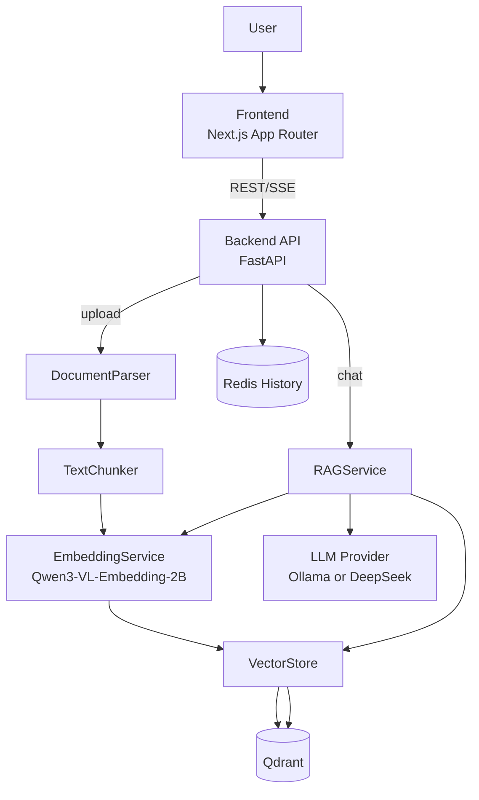

# NexusAI - Customer Knowledge Base

企业知识库问答系统（RAG），支持文档上传、向量检索、流式回答和来源追溯。

## 1. 项目架构



### 组件职责
- `frontend/`: Chat 页面与文件管理页面，消费 REST + SSE。
- `backend/app/routers/`: API 路由层（`upload/files/chat/history/health`）。
- `backend/app/services/`: 文档解析、分块、嵌入、向量库和 RAG 编排。
- `Qdrant`: 存储 chunk 向量与 payload。
- `Redis`: 保存会话历史（`/api/history`）。
- `LLM`: 通过 OpenAI 兼容接口调用（支持 `ollama` / `deepseek` / `openai` / `heiyucode`）。

## 2. Embedding 具体实现

### 2.1 文档到向量的上传链路
1. `POST /api/upload` 读取文件字节流。  
2. `DocumentParser.parse_structured` 按扩展名结构化解析：`.txt/.md/.pdf/.docx/.pptx`。  
3. 解析后保留章节层级（`heading_path/heading_level/section_type`），并抽取文档图片。  
4. `TextChunker.chunk_structured` 基于结构化段落切片（默认 `chunk_size=1000`，`overlap=200`）。  
5. `VisionService.describe_images` 为抽取的图片生成描述，并追加为 `image_description` chunk。  
6. `EmbeddingService.get_embeddings` 调用 `Qwen3VLEmbedder.process` 生成向量。  
7. 若模型输出维度 > `config.VECTOR_DIMENSION`（默认 `1024`），执行截断（MRL 友好）。  
8. `VectorStore.upsert_chunks` 写入 Qdrant，payload 包含：
   - `source_file`
   - `chunk_text`
   - `chunk_index`
   - `heading_path` / `heading_level` / `section_type`
   - `page` / `slide`（可选）
   - `image_id` / `image_location`（图片描述 chunk）

### 2.2 EmbeddingService 关键设计
- 单例初始化：`EmbeddingService.__new__` 避免重复加载大模型。
- 自动设备选择：
  - `mps`（Apple Silicon 优先）
  - `cuda`
  - `cpu`
- dtype 选择：
  - MPS 使用 `float16`
  - 其他默认 `float32`
- 多模态能力已预留：`get_multimodal_embeddings` 支持 `{"text": ...}` / `{"image": ...}` 输入。

### 2.3 向量存储实现要点
- `VectorStore._ensure_collection` 启动时检查 collection 维度。
- 如果实际维度与配置维度不一致，会重建 collection，避免脏数据导致检索失败。
- 距离函数使用 `COSINE`，适合语义检索场景。

## 3. RAG 具体实现

### 3.1 检索增强流程（`RAGService.generate_response`）
1. 将用户 query 向量化。  
2. 在 Qdrant 执行混合检索（Hybrid Search：向量 + 关键词，默认 `alpha=0.7`，`limit=5`）。  
3. 提取命中 chunk，拼接为 `context_text`。  
4. 构造 `system_prompt`，要求“基于检索文档回答，不可编造”。  
5. 追加 Redis 历史对话（`/api/history`）并发送给 LLM。  
6. 使用流式生成返回给上层路由。

### 3.2 Chat SSE 协议（`POST /api/chat`）
后端按如下事件顺序输出：
1. `data: {"sources":[...]}`（一次）  
2. `data: {"token":"..."}`（多次）  
3. `data: [DONE]`（结束标记）  

前端逐行解析 `data:`，实时拼接 token，并渲染来源引用。

### 3.3 失败与兜底策略
- 请求体校验：Pydantic 自动返回 `422`（例如 message 缺失）。
- 上传异常分层：
  - 空文档/不支持格式 -> `400`
  - 其他异常 -> `500`
- 流式阶段异常：输出错误 token，并最终输出 `[DONE]`，避免前端挂起。

## 4. 对应知识点（学习导图）

### 检索与向量化
- Chunking（窗口切片 + overlap）
- Dense Embedding（语义向量）
- MRL 截断（以更低维度保留主要语义）
- Cosine Similarity
- Top-K Retrieval

### 生成与编排
- RAG（Retrieval-Augmented Generation）
- Prompt Grounding（让回答绑定检索上下文）
- Hallucination 控制（无命中时明确告知）
- Multi-turn Context（历史会话拼接）

### 工程实现
- FastAPI 路由分层
- SSE 流式协议（`text/event-stream`）
- Qdrant payload filter delete（按 `source_file` 级联删除）
- Redis 会话持久化
- 严格回归测试矩阵（`feature_list.json` + `backend/run_tests.py`）

## 5. 本地启动

### 5.1 依赖
- Docker（Qdrant/Redis）
- Conda 环境（建议 Python 3.9）
- Node.js 18+

### 5.2 Backend
```bash
cd backend
conda run -n daily_3_9 pip install -r requirements.txt
conda run -n daily_3_9 uvicorn app.main:app --reload --port 8001
```

### 5.2.1 Phase2 关键配置（.env）
```bash
# 结构化解析后端: auto|builtin|unstructured|llamaparse
DOCUMENT_PARSER_BACKEND=auto

# Embedding 后端: local|dashscope|aliyun
EMBEDDING_BACKEND=dashscope
EMBEDDING_MODEL=qwen3-vl-embedding
DASHSCOPE_API_KEY=...
DASHSCOPE_EMBEDDING_MODEL=qwen3-vl-embedding

# 当选择 llamaparse 或 auto 想启用 LlamaParse 时需要
LLAMA_CLOUD_API_KEY=...

# 图片描述（Vision）能力
VISION_ENABLED=true
VISION_MODEL=gpt-4o-mini
VISION_MAX_IMAGES=20
```

说明：
- `EMBEDDING_BACKEND=dashscope` 时，向量化走阿里云线上模型，适合低内存 ECS。
- `DOCUMENT_PARSER_BACKEND=auto` 时优先尝试 `unstructured`，其次 `llamaparse`，失败回退 `builtin`。
- Vision API 不可用时会自动降级为本地图片统计描述，保证入库流程不断。

### 5.2.2 一键切换模型档位（local/local-safe/local-vision/cloud）

项目提供脚本：`scripts/switch_profile.py`，用于一次性更新一整套关键字段。

默认会同时更新：
- `backend/.env`
- `deploy/backend.env`（存在时）

内置档位：
- `local`：本地默认档（`ollama + local embedding + unstructured`）
- `local-safe`：本地保守档（`ollama + local embedding + builtin parser + vision off`）
- `local-vision`：本地视觉档（`ollama + local embedding + 本地 vision`）
- `cloud`：云端档（`heiyucode + dashscope + unstructured`）

示例：

```bash
# 先查看所有内置档位与说明
python3 scripts/switch_profile.py --list-profiles

# 先预览变更（不落盘）
python3 scripts/switch_profile.py local --dry-run
```

输出示例（节选）：

```text
Available profiles:

- local
  说明: 本地默认档：Ollama + 本地 embedding + unstructured 解析，适合日常本地开发。

- local-safe
  说明: 本地保守档：更轻的本地 LLM + builtin parser + vision 关闭，优先稳定性。
```

更多切换示例：

```bash
# 切到本地默认档
python3 scripts/switch_profile.py local

# 切到本地保守档（更稳、更省资源）
python3 scripts/switch_profile.py local-safe

# 切到本地视觉档
python3 scripts/switch_profile.py local-vision

# 切到云端模型档位
python3 scripts/switch_profile.py cloud
```

可选：只改某个文件。

```bash
python3 scripts/switch_profile.py local --file backend/.env
```

可选：切换后自动重启 backend 并等待健康检查通过。

```bash
python3 scripts/switch_profile.py local \
  --file backend/.env \
  --restart-backend \
  --restart-mode local
```

可选：仅检查当前文件中这些关键配置，不做写入。

```bash
python3 scripts/switch_profile.py local --check --file backend/.env
```

### 5.3 Frontend
```bash
cd frontend
npm install
npm run dev
```

## 6. 严格测试与 CI

### 6.1 本地严格回归
```bash
cd backend
conda run -n daily_3_9 python run_tests.py

# 如需把结果回写到 feature_list.json
conda run -n daily_3_9 python run_tests.py --write-feature-status
```

说明：
- 默认只读执行 `feature_list.json` 中全部 `auto` 项，不回写仓库文件。
- 如需更新 `passes` 字段，显式加上 `--write-feature-status`。
- 覆盖基础设施、后端成功/失败路径、前端 lint/build 与关键静态契约检查。

### 6.2 GitHub Actions
- 工作流文件：`.github/workflows/ci.yml`
- 触发：`push`、`pull_request`、`workflow_dispatch`
- 关键步骤：
  - 启动/检查 Qdrant 与 Redis
  - 启动后端
  - 执行 `backend/run_tests.py`

## 7. 参考文档
- 技术深挖：`TECHNICAL_DEEP_DIVE.md`
- 功能验收清单：`feature_list.json`
- 项目进度：`progress.md`
- 云端部署方案：`CLOUD_DEPLOYMENT_RUNBOOK.md`
