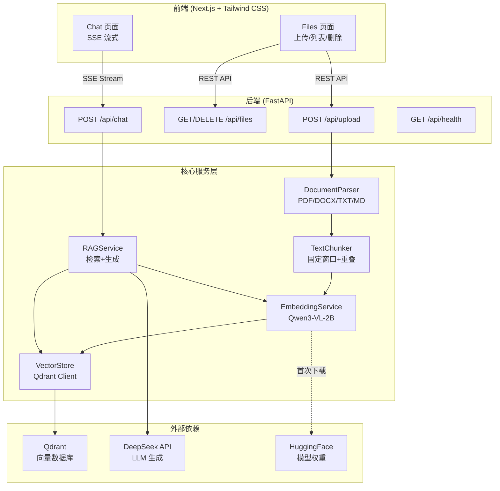
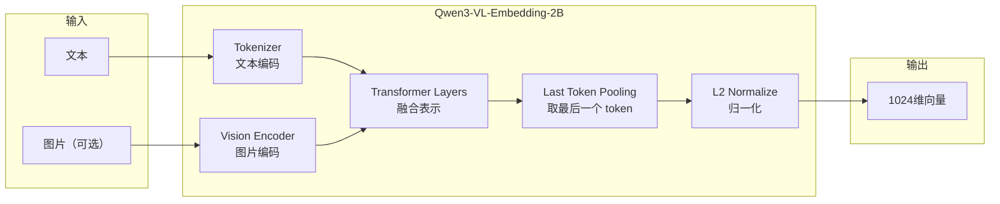

# NexusAI 技术深度解析 — 从零构建 RAG 知识库系统

> 本文档作为学习资料，详细解析 NexusAI 项目中每个技术亮点的**实现原理**、**代码细节**和**设计决策**。

---

## 目录

1. [项目全景架构](#1-项目全景架构)
2. [为什么选这个技术栈](#2-为什么选这个技术栈)
3. [文档解析与分块](#3-文档解析与分块-document-parsing--chunking)
4. [Embedding 向量化：Qwen3-VL-Embedding-2B](#4-embedding-向量化qwen3-vl-embedding-2b)
5. [向量存储：Qdrant](#5-向量存储qdrant)
6. [RAG 检索增强生成](#6-rag-检索增强生成)
7. [SSE 流式响应](#7-sse-流式响应)
8. [前端实现](#8-前端实现)
9. [Harness 工程哲学](#9-harness-工程哲学)
10. [端到端数据流总结](#10-端到端数据流总结)

---

## 1. 项目全景架构



**一句话总结**：用户上传文档 → 解析+分块+嵌入 → 存入 Qdrant → 用户提问 → 检索相关块 → 喂给 LLM 生成答案 → SSE 流式返回。

---

## 2. 为什么选这个技术栈

### Embedding 模型：Qwen3-VL-Embedding-2B

| 候选方案 | 优缺点 |
|---------|--------|
| **OpenAI text-embedding-3** | ✅ 效果好 ❌ 需要付费 API、数据外传 |
| **BAAI/bge-m3** | ✅ 开源、多语言 ❌ 纯文本、无多模态 |
| **Qwen3-VL-Embedding-2B** ✅ | ✅ 开源免费、**多模态（文本+图片）**、32K 上下文、MRL 支持、可本地运行 |

**核心决策理由**：
- **多模态**：原生支持文本和图片嵌入，为未来图片知识库打基础
- **本地运行**：数据不出本机，零延迟无成本，支持 Mac MPS 加速
- **MRL (Matryoshka Representation Learning)**：可以将向量截断到任意维度（1024 维）而不损失太多精度，节省存储
- **32K 上下文**：支持超长文档的单次嵌入

### LLM：DeepSeek

| 候选方案 | 优缺点 |
|---------|--------|
| **GPT-4** | ✅ 顶级效果 ❌ 昂贵 |
| **Llama 本地** | ✅ 免费 ❌ 2B 本地 + 2B embedding 内存压力大 |
| **DeepSeek** ✅ | ✅ 便宜、效果接近 GPT-4、支持 OpenAI 接口格式、深度推理 |

### 向量数据库：Qdrant

| 候选方案 | 优缺点 |
|---------|--------|
| **Pinecone** | ✅ 托管无运维 ❌ 付费、数据上云 |
| **ChromaDB** | ✅ 简单 ❌ 生产不成熟 |
| **Qdrant** ✅ | ✅ 开源、Docker 一键部署、HNSW 高性能、REST + gRPC API |

### 前端：Next.js + Tailwind CSS

- **Next.js App Router**：最新 React 服务端组件架构，开箱即用的路由
- **Tailwind CSS v4**：零样板、快速原型、支持暗色模式

---

## 3. 文档解析与分块 (Document Parsing & Chunking)

### 3.1 文档解析

```python
# backend/app/services/document_parser.py

class DocumentParser:
    @staticmethod
    def parse(file_content: bytes, filename: str) -> str:
        ext = os.path.splitext(filename)[1].lower()
        
        if ext in ['.txt', '.md']:
            return file_content.decode('utf-8')       # 纯文本直接解码
        elif ext == '.pdf':
            reader = PdfReader(io.BytesIO(content))    # pypdf 解析 PDF
            return "\n".join(page.extract_text() for page in reader.pages)
        elif ext == '.docx':
            doc = Document(io.BytesIO(content))        # python-docx 解析 Word
            return "\n".join(para.text for para in doc.paragraphs)
```

**亮点**：
- 使用 `io.BytesIO` 将内存中的字节流转为文件对象，无需写入磁盘
- `pypdf` 比 `PyPDF2` 更现代、维护更活跃
- 扩展性好：新增格式只需加一个 `elif` 分支

### 3.2 文本分块 (Chunking)

```python
# backend/app/services/text_chunker.py

class TextChunker:
    @staticmethod
    def chunk(text, chunk_size=1000, overlap=200) -> List[str]:
        chunks = []
        start = 0
        while start < len(text):
            end = start + chunk_size
            chunks.append(text[start:end])
            start = end - overlap       # ← 关键：重叠滑动窗口
            if end >= len(text):
                break
        return chunks
```

**为什么要分块？**
- 嵌入模型有上下文长度限制（虽然 Qwen3 支持 32K，但仍需分块以提高检索精度）
- 分块越小，检索越精确（能定位到具体段落而非整篇文档）

**为什么要重叠？**
```
文档: [AAAA|BBBB|CCCC|DDDD]

无重叠: [AAAA] [BBBB] [CCCC] [DDDD]
         ↑ 如果答案横跨 A 和 B 的边界，两块都找不全

有重叠: [AAAA BB] [BB CCCC] [CC DDDD]
         ↑ 重叠部分确保边界信息不丢失
```

**参数选择**：`chunk_size=1000, overlap=200` 是经验值，200 字符重叠约 20%，平衡精度与冗余。

---

## 4. Embedding 向量化：Qwen3-VL-Embedding-2B

这是本项目最核心的技术点。

### 4.1 模型架构



### 4.2 关键代码解析

#### 自定义模型类

```python
# backend/app/services/scripts/qwen3_vl_embedding.py

class Qwen3VLForEmbedding(Qwen3VLPreTrainedModel):
    """
    重点：继承 Qwen3VLPreTrainedModel，但不用生成（LM head）部分。
    只取 Transformer 的 hidden state 作为嵌入。
    """
    def __init__(self, config):
        super().__init__(config)
        self.model = Qwen3VLModel(config)  # 只用 backbone，不用 LM head
        self.post_init()

    def forward(self, input_ids, attention_mask, pixel_values=None, ...):
        outputs = self.model(
            input_ids=input_ids,
            pixel_values=pixel_values,          # 图片像素值（如果有）
            attention_mask=attention_mask,
            ...
        )
        return Qwen3VLForEmbeddingOutput(
            last_hidden_state=outputs.last_hidden_state,
            attention_mask=attention_mask,
        )
```

> **为什么不用完整的生成模型？** 嵌入只需要编码器的隐藏状态（hidden state），不需要 LM head（预测下一个 token 的层）。去掉 LM head 可以减少内存占用。

#### Pooling 策略：Last Token Pooling

```python
@staticmethod
def _pooling_last(hidden_state, attention_mask):
    """
    取每个序列中最后一个有效 token 的 hidden state 作为句向量。
    
    为什么用 Last Token 而不是 Mean Pooling？
    - Decoder-only 模型（如 Qwen）的最后一个 token 天然汇聚了所有前文信息
    - Mean Pooling 会被 padding token 稀释
    """
    flipped_tensor = attention_mask.flip(dims=[1])     # 翻转 mask
    last_one_positions = flipped_tensor.argmax(dim=1)  # 找到最后一个 1 的位置
    col = attention_mask.shape[1] - last_one_positions - 1
    row = torch.arange(hidden_state.shape[0], device=hidden_state.device)
    return hidden_state[row, col]                      # 精确取出最后一个有效 token
```

这段代码非常巧妙：
1. `attention_mask` 中 1 = 有效 token，0 = padding
2. 翻转后用 `argmax` 找到从右往左第一个 1 的位置
3. 反算出原始位置，精确提取 last hidden state

#### MRL 维度截断

```python
# backend/app/services/embedding_service.py

def get_embeddings(self, texts: List[str]) -> List[List[float]]:
    inputs = [{"text": text} for text in texts]
    embeddings = self.model.process(inputs)
    
    # MRL: 截断到 1024 维
    if embeddings.shape[1] > config.VECTOR_DIMENSION:
        embeddings = embeddings[:, :config.VECTOR_DIMENSION]
    
    return embeddings.tolist()
```

**MRL (Matryoshka Representation Learning)** 是一种训练方法，使向量的前 N 维仍然保留语义信息：
```
完整向量:  [0.12, 0.45, 0.78, ..., 0.33]  (例如 3584 维)
截断到 1024: [0.12, 0.45, 0.78, ..., 0.91]  (前 1024 维)
                ↑ 语义信息依然充分，像俄罗斯套娃一样
```

好处：存储减少 3x，检索速度更快，精度损失很小。

#### 设备选择

```python
# backend/app/services/embedding_service.py

device = "mps" if torch.backends.mps.is_available() else "cpu"
dtype = torch.float16 if device == "mps" else torch.float32
```

- **MPS (Metal Performance Shaders)**：苹果 Silicon 芯片的 GPU 加速
- **float16**：半精度浮点，内存减半，速度更快，对 embedding 精度影响极小

---

## 5. 向量存储：Qdrant

### 5.1 Collection 配置

```python
# backend/app/services/vector_store.py

def _create_collection(self):
    self.client.create_collection(
        collection_name="nexusai_knowledge_base",
        vectors_config=models.VectorParams(
            size=1024,                        # 向量维度
            distance=models.Distance.COSINE   # 余弦相似度
        )
    )
```

**为什么用余弦相似度？**
- 余弦距离只关心方向（语义相似性），不关心幅度
- 对于已 L2 归一化的向量，余弦距离 = 点积距离，计算更快
- 更符合 NLP 任务的语义比较需求

### 5.2 维度自动校验

```python
def _ensure_collection(self):
    try:
        collection_info = self.client.get_collection(config.COLLECTION_NAME)
        current_dim = collection_info.config.params.vectors.size
        if current_dim != config.VECTOR_DIMENSION:
            # 如果维度变了（比如换了 embedding 模型），自动重建
            self.client.delete_collection(config.COLLECTION_NAME)
            self._create_collection()
    except Exception:
        self._create_collection()  # Collection 不存在则创建
```

> **工程亮点**：切换 embedding 模型时不需要手动清理数据库，自动检测维度不匹配并重建。

### 5.3 向量 ID 生成

```python
def upsert_chunks(self, filename, chunks, embeddings):
    points = []
    for i, (chunk, vector) in enumerate(zip(chunks, embeddings)):
        points.append(models.PointStruct(
            id=abs(hash(f"{filename}_{i}")),  # 用文件名+索引的哈希值作为 ID
            vector=vector,
            payload={
                "source_file": filename,      # 来源文件 → 用于引用和删除
                "chunk_text": chunk,           # 原始文本 → 用于 RAG 上下文
                "chunk_index": i               # 块序号 → 用于排序还原
            }
        ))
```

**Payload 设计**：
- `source_file`：支持按文件名过滤删除（级联删除）
- `chunk_text`：检索后直接取出原文投喂 LLM，无需二次查询
- `chunk_index`：保留顺序信息，可用于还原上下文

### 5.4 级联删除

```python
def delete_by_file(self, filename):
    self.client.delete(
        collection_name=config.COLLECTION_NAME,
        points_selector=models.FilterSelector(
            filter=models.Filter(
                must=[
                    models.FieldCondition(
                        key="source_file",
                        match=models.MatchValue(value=filename)
                    )
                ]
            )
        )
    )
```

> 删除一个文件时，自动删除该文件的所有向量块。这就是为什么 `source_file` 存在 payload 中——它既是元数据，也是删除索引。

---

## 6. RAG 检索增强生成

RAG 是本项目的核心算法，将检索和生成有机结合。

### 6.1 完整的 RAG 流水线

```python
# backend/app/services/rag_service.py

class RAGService:
    def generate_response(self, query: str):
        # Step 1: 将用户问题向量化（同一个 embedding 模型）
        query_vector = self.embedding_service.get_embeddings([query])[0]
        
        # Step 2: 在 Qdrant 中搜索最相关的 5 个文本块
        hits = self.vector_store.search(query_vector, limit=5)
        
        # Step 3: 构建上下文 + 追踪来源文件
        context_parts = []
        sources = set()
        for hit in hits:
            context_parts.append(hit["chunk_text"])
            sources.add(hit["source_file"])
        
        context_text = "\n\n---\n\n".join(context_parts)
        
        # Step 4: Prompt Engineering
        system_prompt = (
            "You are a helpful assistant for NexusAI. "
            "Use the following pieces of retrieved context "
            "to answer the user's question. "
            "If you don't know the answer, just say that you don't know...\n\n"
            f"Context:\n{context_text}"
        )
        
        # Step 5: 调用 LLM 流式生成
        response = self.llm_client.chat.completions.create(
            model="deepseek-chat",
            messages=[
                {"role": "system", "content": system_prompt},
                {"role": "user", "content": query}
            ],
            stream=True
        )
        
        return response, list(sources)  # 返回流式响应 + 引用来源
```

### 6.2 为什么 Query 和 Document 用同一个模型嵌入？

```
查询：  "什么是 RAG？"        → Embedding Model → [0.12, 0.45, ...]
文档块："RAG 全称检索增强生成" → Embedding Model → [0.13, 0.44, ...]
                                                    ↑ 语义相近，向量距离小
```

**关键原理**：同一个模型把语义相近的文本映射到向量空间中相近的位置。如果查询和文档用不同模型嵌入，向量空间不对齐，余弦相似度无意义。

### 6.3 Prompt Engineering 的设计

```
System Prompt = 角色定义 + 行为约束 + 检索上下文
                    ↓            ↓           ↓
           "你是 NexusAI 助手" "不知道就说不知道" "Context:\n{检索到的文本}"
```

**为什么把上下文放在 system prompt 而不是 user message？**
- System prompt 是 LLM 的「世界知识」，优先级更高
- 避免用户消息和上下文混淆
- DeepSeek 在 system prompt 中对上下文的遵循度更好

### 6.4 向量检索 (Approximate Nearest Neighbor)

```python
def search(self, query_vector, limit=5):
    results = self.client.query_points(
        collection_name=config.COLLECTION_NAME,
        query=query_vector,
        limit=limit,              # Top-5 最相关块
        with_payload=True         # 返回 payload（包含原文）
    )
    return [hit.payload for hit in results.points]
```

Qdrant 使用 **HNSW (Hierarchical Navigable Small World)** 算法进行近似最近邻搜索：
- 时间复杂度 O(log N)，比暴力搜索的 O(N) 快得多
- 在百万级向量上仍然毫秒级响应
- 精度 > 95%（极少数情况会漏掉真正最近的邻居）

---

## 7. SSE 流式响应

### 7.1 后端实现

```python
# backend/app/routers/chat.py

@router.post("/chat")
async def chat(request: ChatRequest):
    response_gen, sources = rag_service.generate_response(request.message)
    
    async def stream_response():
        # 第一条消息：发送引用来源（让前端提前展示）
        yield f"data: {json.dumps({'sources': sources})}\n\n"
        
        # 逐 token 流式返回
        for chunk in response_gen:
            if chunk.choices[0].delta.content:
                token = chunk.choices[0].delta.content
                yield f"data: {json.dumps({'token': token})}\n\n"
        
        # 终止信号
        yield "data: [DONE]\n\n"

    return StreamingResponse(stream_response(), media_type="text/event-stream")
```

**SSE (Server-Sent Events) 协议格式**：
```
data: {"sources": ["doc1.pdf", "doc2.txt"]}    ← 第一条：来源

data: {"token": "根据"}                         ← 逐 token 推送
data: {"token": "文档"}
data: {"token": "内容"}
data: {"token": "，"}
...
data: [DONE]                                    ← 结束标记
```

**为什么 sources 先发？** 用户看到引用来源时，LLM 生成可能还没开始（DeepSeek Reasoner 有思考时间）。先展示来源提升用户体验。

### 7.2 前端消费 SSE

```javascript
// frontend/src/app/page.js

const response = await fetch("http://localhost:8001/api/chat", {
    method: "POST",
    headers: { "Content-Type": "application/json" },
    body: JSON.stringify({ message: input }),
});

const reader = response.body.getReader();    // 取得 ReadableStream
const decoder = new TextDecoder();

while (true) {
    const { value, done } = await reader.read();
    if (done) break;

    const chunk = decoder.decode(value);
    const lines = chunk.split("\n");

    for (const line of lines) {
        if (line.startsWith("data: ")) {
            const dataStr = line.replace("data: ", "").trim();
            if (dataStr === "[DONE]") break;

            const data = JSON.parse(dataStr);
            if (data.token) {
                // 追加 token 到最后一条 AI 消息
                last.text += data.token;
            } else if (data.sources) {
                // 设置引用来源
                last.sources = data.sources;
            }
        }
    }
}
```

**为什么用 SSE 而不是 WebSocket？**
- SSE 是单向的（服务端 → 客户端），完美匹配 LLM 流式输出场景
- 基于 HTTP，无需额外协议握手
- 浏览器原生支持，代码更简单
- WebSocket 适合双向实时通信（聊天室），这里用不上

---

## 8. 前端实现

### 8.1 布局架构

```
┌──────────────────────────────────┐
│  Header (固定)                     │  ← Header.jsx
│  [NexusAI Logo]  [Chat] [Files]  │     导航高亮用 usePathname()
├──────────────────────────────────┤
│                                  │
│  <main> (flex-1, overflow-hidden)│  ← layout.js
│    └── {children}                │     Chat 或 Files 页面
│                                  │
└──────────────────────────────────┘
```

- `h-screen overflow-hidden` 在 body：全屏无滚动
- `flex-col` 布局让 Header 固定、内容区自适应
- `overflow-hidden` 在 main 上，让各页面自己管滚动

### 8.2 暗色模式

```html
<html lang="en" className="dark">
```

```css
/* globals.css */
@theme {
  --color-background-dark: #111318;
  --color-surface-dark: #1a1d24;
  --color-surface-lighter: #242832;
}
```

直接在 `<html>` 上加 `class="dark"`，全局启用暗色模式。Tailwind CSS 的 `dark:` 前缀自动生效。

### 8.3 文件列表的数据流

```
GET /api/files → [{filename: "doc.pdf", status: "Ready"}, ...]
                     ↓
                files.map(file => (
                    <span>{file.filename}</span>
                    <StatusBadge status={file.status.toLowerCase()} />
                    <button onClick={() => handleDelete(file.filename)}>
                ))
```

> **我们修复的 Bug**：之前前端把 `file` 当字符串用 (`{file}`)，但 API 返回的是对象 (`{filename, status}`)。

---

## 9. Harness 工程哲学

NexusAI 采用 "Harness" 方法论来确保工程质量。

### 9.1 三层验证体系

```
Layer 1: init.sh          → 环境检查（Python、Node.js、Qdrant）
Layer 2: harness_check.py → 组件验证（API Key、模型加载、服务连通）
Layer 3: run_tests.py     → 端到端验证（上传→检索→聊天→删除）
```

### 9.2 Feature List 驱动开发

```json
{
    "id": "backend-003",
    "category": "Backend",
    "description": "RAG Chat: POST /api/chat returns SSE stream...",
    "steps": [
        {
            "action": "POST http://localhost:8001/api/chat ...",
            "expected": "status=200, content-type contains 'text/event-stream'...",
            "type": "auto"
        }
    ],
    "passes": true
}
```

每个 feature 有：
- **唯一 ID**：可追踪
- **精确步骤**：`action` + `expected` 消除歧义
- **类型标注**：`auto`（脚本可测）vs `browser`（需人工/浏览器）
- **通过状态**：`run_tests.py` 自动更新

---

## 10. 端到端数据流总结

### 上传文档

```
用户拖拽 PDF 到前端
    ↓
POST /api/upload (multipart/form-data)
    ↓
DocumentParser.parse(bytes, "doc.pdf")
    ↓ 提取纯文本
TextChunker.chunk(text, size=1000, overlap=200)
    ↓ 得到 N 个文本块
EmbeddingService.get_embeddings(chunks)
    ↓ Qwen3-VL → N 个 1024 维向量
VectorStore.upsert_chunks("doc.pdf", chunks, vectors)
    ↓ 写入 Qdrant（payload 含原文+文件名+序号）
返回 {filename, status: "Ready", chunks_count: N}
```

### 提问流程

```
用户输入 "什么是 RAG？"
    ↓
POST /api/chat {message: "什么是 RAG？"}
    ↓
EmbeddingService.get_embeddings(["什么是 RAG？"])
    ↓ 得到 query_vector (1024 维)
VectorStore.search(query_vector, limit=5)
    ↓ Qdrant HNSW 搜索 → Top-5 文本块 + 来源文件
RAGService.generate_response()
    ↓ 拼接 context → system prompt → DeepSeek API (stream=True)
StreamingResponse(SSE)
    ↓
data: {"sources": ["doc.pdf"]}
data: {"token": "RAG"}
data: {"token": "（检索"}
data: {"token": "增强"}
data: {"token": "生成）"}
data: {"token": "是一种..."}
data: [DONE]
```

---

## 附录：关键配置一览

```python
# backend/app/config.py

EMBEDDING_MODEL = "Qwen/Qwen3-VL-Embedding-2B"   # 本地多模态嵌入
LLM_MODEL = "deepseek-chat"                        # DeepSeek API
VECTOR_DIMENSION = 1024                             # MRL 截断维度
CHUNK_SIZE = 1000                                   # 分块大小（字符）
CHUNK_OVERLAP = 200                                 # 重叠大小（字符）
QDRANT_HOST = "localhost"                           # Qdrant 地址
QDRANT_PORT = 6333                                  # Qdrant 端口
COLLECTION_NAME = "nexusai_knowledge_base"          # 集合名称
```
